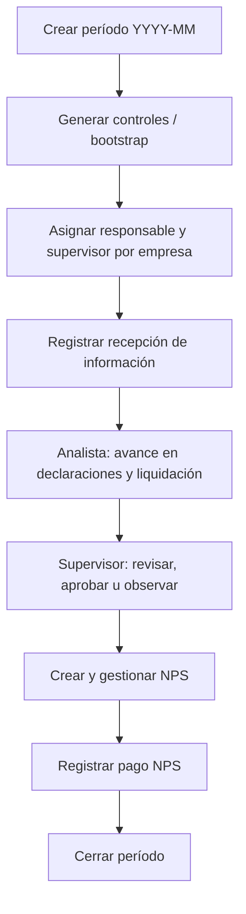

# Guía de uso — Módulo Supervisores Contables

Documento operativo: cómo están modeladas las **tareas contables** en el sistema y qué registrar en cada pantalla del módulo.

---

## 1. ¿Cómo se implementaron las «tareas contables»?

En el requerimiento original existe la tabla sugerida `tareas_contables`. **En miweb no hay una tabla con ese nombre.** El mismo concepto se reparte así:

| Concepto del requerimiento | Implementación real | Tabla / entidad |
|----------------------------|---------------------|-----------------|
| Período contable mensual | Período del módulo | `supervisor_periods` |
| Control por empresa y mes | «Control mensual» (cabecera de trabajo) | `supervisor_monthly_controls` |
| Tarea: PDT 601, 621, SIRE, Renta anual | **Declaraciones** (una fila por tipo) | `supervisor_declarations` |
| Tarea: liquidación de impuestos | **Liquidación tributaria** (1 por control) | `supervisor_tax_liquidations` |
| Tarea: NPS / pago | Registros **NPS** (varios por control) | `supervisor_nps` |
| Avance, prioridad, vencimiento, responsable | Campos en cada **declaración** | `progress_pct`, `priority`, `due_date`, `responsible_user_id` |
| Observaciones | Observaciones + notas en declaración/liquidación | `supervisor_observations` |
| Adjuntos | Archivos por control o por declaración | `supervisor_attachments` |
| Historial | Auditoría de cambios | `supervisor_change_logs` |
| Alertas | Notificaciones in-app | `supervisor_notifications` |

### Creación automática de «tareas»

Al **generar controles** del período (bootstrap), por cada empresa se crea:

1. Un **control mensual** (`supervisor_monthly_controls`).
2. Cuatro **declaraciones** en estado `pendiente`, prioridad `media`:
   - PDT 601 (`pdt_601`)
   - PDT 621 (`pdt_621`)
   - SIRE (`sire`)
   - Renta anual (`renta_anual`)
3. Una **liquidación** vacía en estado `pendiente`.

El responsable y supervisor del control se copian de la ficha de **Empresa** (`accountant_user_id` → responsable, `supervisor_user_id` → supervisor), si están definidos.

### Automatización en segundo plano

Cada ~6 horas el backend (`RunMonthlyAutomations`):

- Abre el período del mes actual si no existe.
- Genera controles faltantes para empresas activas.
- Marca controles y NPS vencidos según fechas.
- Envía notificaciones (sin duplicar las no leídas del mismo tipo).

---

## 2. Flujo recomendado (orden de trabajo)

**Rutas en la aplicación** (menú Supervisores):

| Pantalla | Ruta |
|----------|------|
| Dashboard | `/supervisors/dashboard` |
| Períodos | `/supervisors/periods` |
| Control mensual (listado) | `/supervisors/controls` |
| Detalle por empresa | `/supervisors/controls/:id` |
| Reportes | `/supervisors/reports` |
| Notificaciones | `/supervisors/notifications` |

---

## 3. Roles y qué puede hacer cada uno

| Acción | Gerencia / Supervisor | Analista |
|--------|------------------------|----------|
| Ver dashboard completo | Sí | Sí (filtrado a sus controles como responsable) |
| Crear período y bootstrap | Sí | Solo ver períodos |
| Crear control manual | Sí | No |
| Asignar responsable/supervisor en control | Sí | No (solo ver) |
| Actualizar avance en declaraciones | Sí | Sí |
| Aprobar / observar declaraciones | Sí | No |
| Aprobar / observar liquidación | Sí | No (solo editar montos) |
| Crear / generar / eliminar NPS | Sí | No crear; sí actualizar estados permitidos |
| Registrar pago NPS | Sí | No |
| Cerrar período | Sí | No |
| Reportes y exportaciones | Sí | Sí (vista limitada en dashboard) |

> **Nota:** El rol **Gerencia** tiene el mismo conjunto de permisos de supervisor en RBAC; debe asignarse al usuario en Administración → Roles.

---

## 4. Pasos por pantalla

### 4.1 Dashboard (`/supervisors/dashboard`)

**Para qué sirve:** Vista resumen del período; no registra datos, solo consulta y enlaces.

**Pasos:**

1. Elija el **período** (campo mes `YYYY-MM`).
2. Opcional: filtre por **estado general**, **riesgo**, **empresa**, **responsable** o **supervisor**.
3. Revise KPIs: empresas activas, al día, pendientes, vencidas, sin control, cumplimiento %, declaraciones observadas, NPS y pagos pendientes.
4. Use la tabla **Productividad por responsable** para ver carga por analista.
5. Abra alertas con enlace al **detalle del control**.
6. Navegue a Control mensual, Períodos, Reportes o Notificaciones.

**Analista:** al entrar, el filtro de responsable se fija al usuario actual (solo ve sus empresas asignadas).

---

### 4.2 Períodos (`/supervisors/periods`)

**Para qué sirve:** Abrir el mes contable y disparar la creación masiva de controles (tareas).

#### Crear un período nuevo

1. Clic en crear / formulario de nuevo período.
2. Indique **mes** (`YYYY-MM`, ej. `2026-05`).
3. Opcional: **notas** del período.
4. Marque **«Generar controles al crear»** si desea el bootstrap inmediato (recomendado).
5. Guardar.

**Resultado:** período en estado `abierto`. Si bootstrap está activo, se crean controles + declaraciones + liquidación para cada empresa **activa** que aún no tenga control en ese mes.

#### Generar controles en un período ya creado

1. En la fila del período, use **«Generar controles»** (bootstrap).
2. El sistema muestra cuántos se **crearon** y cuántos se **omitieron** (ya existían).

#### Editar notas del período

1. **Editar notas** en la fila → modifique texto → **Guardar**.

#### Cerrar el período

1. Verifique que todas las empresas cumplan (ver sección 6).
2. **Cerrar período** en la fila.
3. Si falla, revise el mensaje: declaraciones 601/621/SIRE, liquidación aprobada o controles aún pendientes/vencidos.

---

### 4.3 Control mensual — listado (`/supervisors/controls`)

**Para qué sirve:** Listar y filtrar controles; crear uno manual; ir al detalle.

#### Consultar

1. Filtre por **período**, **empresa** (búsqueda) y **estado general**.
2. Revise columnas: empresa, período, estado, riesgo, responsable, supervisor, vencimiento.
3. Clic en **Detalle** para trabajar la empresa.

#### Crear un control manual (una empresa)

1. **Nuevo control**.
2. Período + empresa (debe existir período abierto y no duplicar empresa/período).
3. Guardar → se crean automáticamente las 4 declaraciones y la liquidación.

---

### 4.4 Detalle del control (`/supervisors/controls/:id`)

**Para qué sirve:** Registrar todo el trabajo mensual de **una empresa**. Es la pantalla principal de «tareas».

#### A. Cabecera del control

| Qué registrar | Dónde / cómo |
|---------------|--------------|
| Recepción de información del cliente | Botón **Registrar recepción de información** |
| Régimen tributario, vencimiento, riesgo, estado general | Bloque **Datos del control** (requiere permiso actualizar control) |
| Responsable y supervisor del mes | Selectores en el mismo bloque |
| Observaciones internas del control | Textarea **Observaciones internas** |

#### B. Pestaña «Declaraciones» (≈ tareas contables PDT/SIRE)

Cada fila es una tarea automática creada en el bootstrap.

| Campo | Quién lo actualiza | Cómo |
|-------|-------------------|------|
| Estado | Analista / Supervisor | Lista: Pendiente → En elaboración → En revisión → … |
| Avance % | Analista / Supervisor | Número 0–100 (también se ajusta al cambiar estado) |
| Prioridad | Analista / Supervisor | Baja / Media / Alta / Crítica |
| Fecha vencimiento | Analista / Supervisor | Campo fecha |
| Responsable / Aprobador de la tarea | Supervisor (con permiso usuarios) | Selectores |
| Adjuntos de la tarea | Quien tenga permiso adjuntos | **Subir** en la columna Adjuntos de esa fila |
| Aprobar tarea | Supervisor / Gerencia | Botón **Aprobar** → estado `aprobado`, avance ~85 % |
| Observar tarea | Supervisor / Gerencia | **Observar** → texto; estado `observado`; crea observación en historial |

**Estados posibles:** pendiente, en_elaboracion, en_revision, observado, aprobado, presentado, cerrado.

#### C. Pestaña «Liquidación»

| Qué registrar | Cómo |
|---------------|------|
| IGV, renta mensual, otros tributos | Campos numéricos |
| Total a pagar | Calculado automáticamente al guardar |
| Responsable y aprobador de liquidación | Selectores |
| Estado de validación | pendiente / aprobada / observada |
| Notas | Textarea |
| Guardar | **Guardar liquidación** |
| Aprobar | **Aprobar liquidación** (supervisor) → `aprobada` |
| Observar | **Observar liquidación** (supervisor) → `observada` + nota |

#### D. Pestaña «NPS»

| Paso | Acción |
|------|--------|
| 1 | **Agregar NPS**: tributo, importe, fecha vencimiento de pago |
| 2 | **Generar** (asigna código/fecha según flujo backend) |
| 3 | Editar fila: código NPS, estado, vencimiento, notas |
| 4 | Estados: pendiente_generar → generado → enviado_cliente → pendiente_pago → pagado / vencido |
| 5 | **Registrar pago** cuando el cliente pagó |

> Analista: no puede crear NPS ni registrar pagos; sí puede actualizar en la medida de sus permisos.

#### E. Pestaña «Historial»

| Qué registrar | Cómo |
|---------------|------|
| Observación general del control | Sección Observaciones → texto → **Agregar** |
| Adjuntos del control (no ligados a una declaración) | Sección Adjuntos → **Subir archivo** |
| Historial de cambios | Solo lectura (automático al guardar campos) |

---

### 4.5 Reportes (`/supervisors/reports`)

**Para qué sirve:** Consultar y exportar (Excel/PDF); no crea registros nuevos.

1. Elija **período**.
2. Elija pestaña de reporte:

| Pestaña | Contenido |
|---------|-----------|
| Mensual | Cuadro general: estado, riesgo, **cumplimiento %**, NPS/pagos pendientes, total a pagar |
| Vencidas | Controles en estado vencido |
| Decl. pendientes | Empresas con 601/621/SIRE sin cerrar |
| NPS pendientes | NPS por generar/enviar |
| Pagos pendientes | NPS pendientes de pago o vencidos |
| Productividad | % cumplimiento por analista responsable |
| Observaciones | Historial de observaciones del período |

3. Use búsqueda por RUC/razón social (salvo productividad).
4. Exporte con **Excel** o **PDF** si necesita archivo.

---

### 4.6 Notificaciones (`/supervisors/notifications`)

**Para qué sirve:** Leer alertas automáticas (vencimientos, observaciones, NPS listo, etc.).

1. Opcional: marque **Solo no leídas**.
2. Abra el enlace al control si la notificación lo incluye.
3. Marque como leída al atenderla.

No se crean notificaciones manualmente desde esta pantalla.

---

## 5. Equivalencia rápida: requerimiento → pantalla

| Paso del requerimiento (§5) | Dónde se hace |
|----------------------------|---------------|
| 1. Crear período mensual | **Períodos** |
| 2. Asignar empresa a responsable | **Empresa** (contador/supervisor) + **Detalle control** |
| 3. Registrar recepción de información | **Detalle control** → botón recepción |
| 4. Crear tareas 601, 621, SIRE, liquidación | Automático en **bootstrap** / nuevo control |
| 5. Analista actualiza avance | **Detalle** → pestaña Declaraciones (+ liquidación) |
| 6–7. Supervisor revisa / aprueba u observa | **Detalle** → Aprobar/Observar en declaraciones y liquidación |
| 8. Generar NPS | **Detalle** → pestaña NPS → Generar |
| 9. Registrar pago | **Detalle** → NPS → Registrar pago |
| 10. Cerrar período | **Períodos** → Cerrar |

---

## 6. Condiciones para cerrar un período

El sistema **bloquea el cierre** si, para algún control del período:

- **PDT 601, 621 o SIRE** no están en estado `aprobado`, `presentado` o `cerrado`.
- La **liquidación** no está en `aprobada`.
- Existen controles cuyo **estado general** no es `al_dia` ni `cerrado`.

Además, conviene tener NPS y pagos al día según su proceso interno (el cierre no exige todos los NPS pagados, pero los reportes los seguirán mostrando).

---

## 7. Configuración previa recomendada

Antes del primer mes de uso:

1. **Empresas** en estado `activo`.
2. En cada empresa: **contador/responsable** y **supervisor** asignados (para el bootstrap).
3. Usuarios con rol **Supervisor**, **Gerencia** o **Analista** y permisos RBAC sincronizados (reinicio de app o seed RBAC tras desplegar).
4. Crear período del mes y ejecutar **Generar controles**.

---

## 8. Referencia técnica (desarrollo)

| Recurso | Ubicación |
|---------|-----------|
| Modelos | `models/supervisor.go`, `models/supervisor_audit.go` |
| Lógica de negocio | `services/supervisor_service.go`, `services/supervisor_audit.go` |
| API | `controllers/supervisor_controller.go`, rutas `/api/supervisors/*` |
| Vistas React | `frontend-react/src/pages/supervisors/` |
| Permisos | `database/rbac_seed.go`, códigos `supervisors.*` en `frontend-react/src/rbac/codes.ts` |
| Requerimiento funcional | `requerimiento.md` |

---

*Última actualización: alineado con la implementación actual del módulo (sin tabla `tareas_contables`; tareas = declaraciones + liquidación + NPS por control mensual).*
